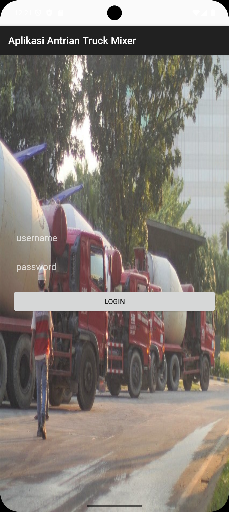
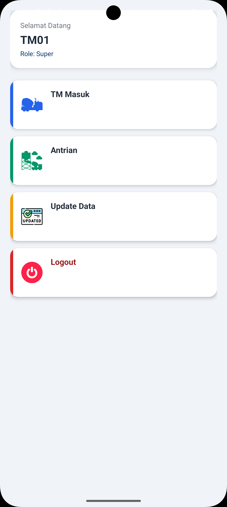
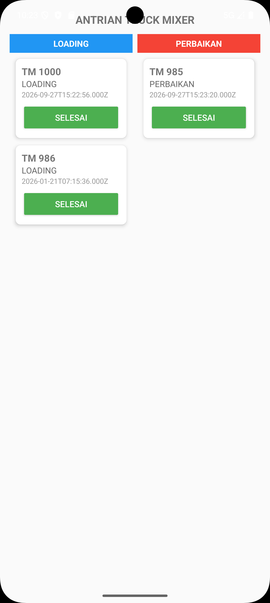
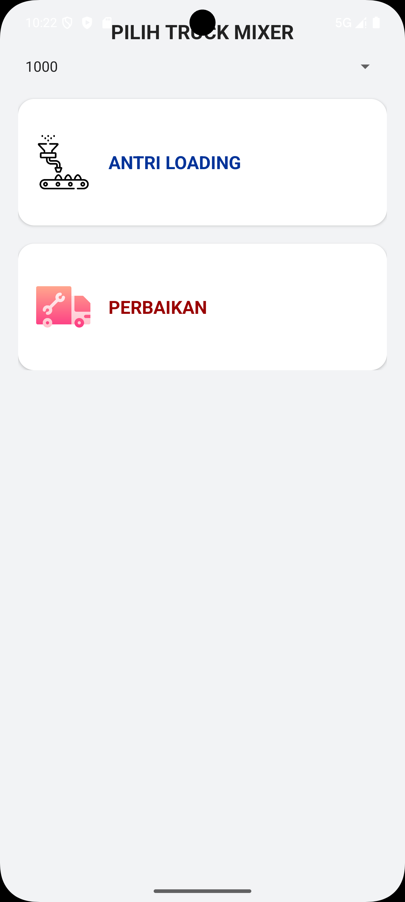
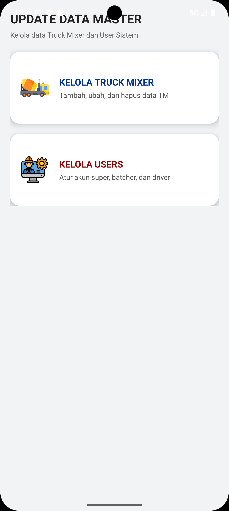

# 🚚 Truck Mixer Management System

Aplikasi Android untuk membantu pengelolaan data dan aktivitas operasional Truck Mixer. 
Aplikasi ini dikembangkan menggunakan Kotlin dan terintegrasi dengan REST API berbasis Node.js serta database MySQL.

## 📱 About The Project

Truck Mixer Management System dirancang untuk membantu proses pengelolaan Truck Mixer, mulai dari autentikasi pengguna, pencatatan Truck Mixer masuk, data loading & perbaikan, hingga sistem antrean.

Project ini merupakan implementasi aplikasi mobile yang terintegrasi dengan backend dan database melalui REST API.

## ✨ Features

- 🔐 User Login
- 🚚 Data Truck Mixer
- 📋 Truck Mixer Masuk
- 📅 Data Booking
- 🚦 Sistem Antrean Truck Mixer
- 🔄 Integrasi REST API
- 🗄️ Database MySQL
- 📱 Android Mobile Application

## 🛠️ Technologies

### Mobile Application

- Kotlin
- Android Studio
- Android SDK
- XML Layout
- Volley

### Backend

- Node.js
- Express.js
- REST API

### Database

- MySQL
- XAMPP
- phpMyAdmin
## 📸 Application Screenshots

<table>
  <tr>
    <td align="center">
      <b>Login</b> 
      
    </td>
    <td align="center">
      <b>Dashboard</b> 
      
    </td>
    <td align="center">
      <b>Truck Mixer List</b> 
      
    </td>
  </tr>
  <tr>
    <td align="center">
      <b>Booking</b> 
      
    </td>
    <td align="center">
      <b>Update Data</b> 
      
    </td>
  </tr>
</table>
